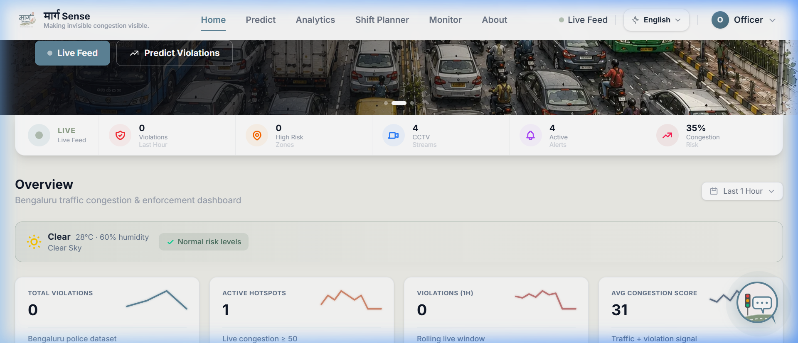
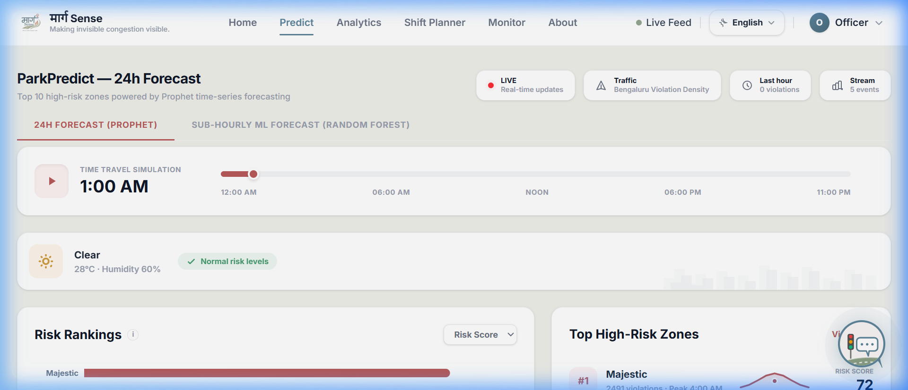
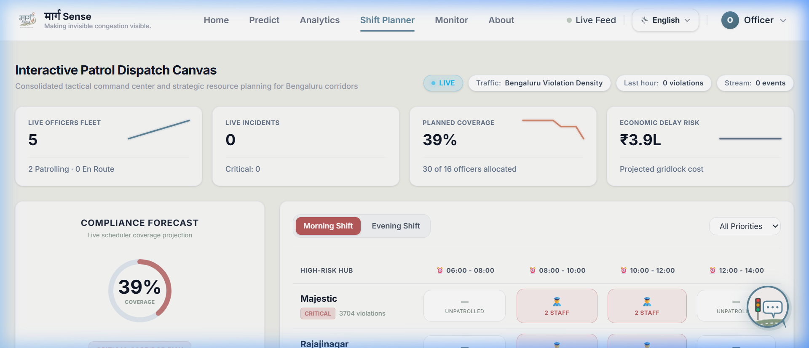
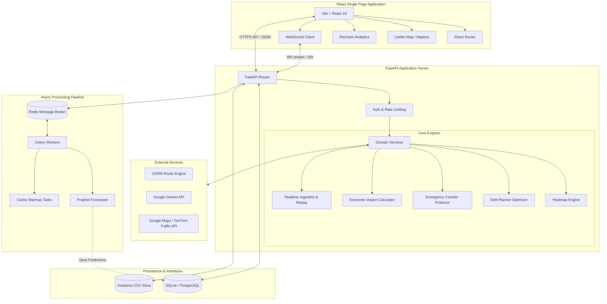

# 🚦 ParkSense AI (मार्ग Sense)

**Bengaluru's AI-Powered Parking Congestion Intelligence & Traffic Enforcement Platform**

[](https://fastapi.tiangolo.com/)
[](https://react.dev/)
[](https://tailwindcss.com/)
[](https://www.docker.com/)
[](https://docs.celeryq.dev/)
[](https://redis.io/)

ParkSense AI (मार्ग Sense) is a next-generation civic management and predictive law-enforcement platform designed for Bengaluru. It leverages AI models, spatial optimization algorithms, and real-time streaming data to transition traffic management from *reactive enforcement* to *proactive prevention*.

---

## 🌟 Key Capabilities

### 1. 🔮 ParkPredict (Time-Series Forecasting)
* Powered by **Facebook Prophet** and custom short-term regression models.
* Predicts parking violations and congestion hotspots 24 hours in advance at high-risk zones across Bengaluru (Koramangala, HSR Layout, Indiranagar, MG Road, Silk Board, Whitefield).
* Accounts for time of day, day of week, seasonal events, and local weather forecasts.

### 2. ⚡ Live Congestion & Route Optimization
* **Real-time Replay Feed:** Replays 298,000+ real Bengaluru police parking violation records to simulate live streaming data.
* **WebSocket Updates:** Real-time dashboard synchronization every 30 seconds via `/live/ws` without manual refreshes.
* **Green Corridor Protector:** Runs spatial buffer analysis (using intersection data and live alerts) to detect blocking violations on critical routes for emergency vehicles (ambulances, fire trucks).
* **AI Camera Monitor:** Visual simulation of CCTV traffic streams with real-time bounding boxes detecting illegal parking behaviors (double-parking, wrong-side parking, footpath obstruction).

### 3. 🌱 Eco-Routing & Civic Standing
* **Standard vs. Eco routing:** Connects to **OSRM (Open Source Routing Machine)** to compare standard routes with eco-friendly bypasses.
* **Environmental Impact Calculator:** Computes fuel saved (liters) and $CO_2$ offsets (kg) for using eco routes, letting commuters log their savings to a database-backed profile.
* **Civic Standing Score:** Analyzes vehicle history to rank drivers from **Clean Commuters** to **Chronic Offenders** with a dynamic points system (100 down to 10 points).

### 4. 👮 Officer Shift Planner (Optimization)
* Formulates a spatial-temporal optimization problem to maximize coverage of projected violations.
* Recommends optimal deployment schedules, patrol assignments, and hot-zone counts.
* Bridges the gap between predictive intelligence and ground enforcement.

### 5. 🤖 Gemini LLM Integration
* **Natural Language Copilot:** A chat assistant (`gemini-2.5-flash`) that allows traffic operators and officers to query live database stats, run scenario predictions, or ask for guidance using normal conversations.
* **Localization:** Provides instant translations of alerts, notices, and dashboard labels into **Hindi** and **Kannada** using LLM context mapping.

---

## 📸 Application Screenshots

### 🖥️ Main Dashboard & Command Center
*Detailed real-time monitoring dashboard displaying live violation counts, active BBMP/BTP traffic alerts, connected Bengaluru road network lines, citizen vehicle lookup tool, and the eco-routing panel.*


### 🔮 Predictive Forecaster (ParkPredict)
*Hourly violation forecast projections for the next 24 hours across active Bengaluru zones, highlighting peak alert times and congestion levels.*


### 👮 Shift Planner & Patrol Optimizer
*Spatial-temporal shift optimizer recommendations showing patrol allocations, coverage stats, and targeted officer deployment schedules.*


---

## 📐 System Architecture



---

## 📂 Project Structure

```
parksense/
├── backend/
│   ├── app/
│   │   ├── auth/            # JWT authentication, dependencies, and roles
│   │   ├── models/          # Prophet forecaster, severity classifier, schemas, databases
│   │   ├── services/        # Analytics, corridors, economic, traffic, shift planner services
│   │   ├── routes/          # REST endpoints (auth, chat, analytics, shift-planner, public)
│   │   ├── tasks/           # Celery task definitions (forecasting, cache warming)
│   │   ├── data/            # CSV violation loaders, cached maps, routing routes
│   │   ├── middleware/      # Rate-limiting, logging, CORS configuration
│   │   ├── database.py      # SQLAlchemy engine configuration
│   │   └── main.py          # FastAPI startup and WebSocket loop
│   ├── Dockerfile
│   ├── requirements.txt     # Python backend dependencies
│   ├── run.py               # Main development startup entrypoint
│   └── *.md                 # Deep-dive documentation (AUTH.md, LIVE.md, etc.)
│
├── frontend/
│   ├── src/
│   │   ├── api/             # API client setup and endpoints
│   │   ├── components/      # Common UI components (Navbar, Sidebar, Map, ShiftPlanner)
│   │   ├── context/         # Auth (JWT) & Localization (EN/HI/KN) Context providers
│   │   ├── layouts/         # Citizen (UserLayout) and Officer (DashboardLayout) layouts
│   │   ├── pages/           # Pages (Homepage, Analytics, Predict, Corridors, CameraMonitor)
│   │   ├── hooks/           # Custom React hooks (WS connections, geolocation)
│   │   └── index.css        # Premium UI theme & Tailwind utilities
│   ├── Dockerfile
│   ├── nginx.conf           # Production deployment web server config
│   ├── vite.config.js       # Vite build configurations with backend proxy setup
│   └── package.json         # Node.js dependencies
│
└── docker-compose.yml       # Production-grade full-stack orchestration
```

---

## 🚀 Setup & Installation

### Prerequisites
* **Python** 3.10+
* **Node.js** 18+
* **Docker** & **Docker Compose** (optional)
* **Redis** (for Celery workers)

---

### 💻 Local Development Setup

#### 1. Clone the repository and place the dataset
Ensure you have the Flipkart Gridlock hackathon dataset `jan to may police violation_anonymized791b166 (2).csv` placed in the root directory.

#### 2. Run the Backend
```bash
# Navigate to the backend directory
cd backend

# Create a virtual environment
python -m venv venv

# Activate the virtual environment
# On Windows:
venv\Scripts\activate
# On macOS/Linux:
source venv/bin/activate

# Install dependencies
pip install -r requirements.txt

# Create environment configuration
copy .env.example .env

# Run the development server
python run.py
```
* **API Documentation:** [http://localhost:8000/docs](http://localhost:8000/docs)
* **API Entrypoint:** [http://localhost:8000](http://localhost:8000)

#### 3. Run the Frontend
```bash
# In a new terminal tab, navigate to the frontend directory
cd frontend

# Install dependencies
npm install

# Run the frontend server
npm run dev
```
* **Frontend Web App:** [http://localhost:5173](http://localhost:5173)

---

### 🐳 Full-Stack Docker Deployment

You can build and spin up the complete containerized stack (Vite SPA, FastAPI, Celery, Redis) with a single command:

```bash
# Build and run containers
docker compose up --build
```

#### Service Endpoints in Docker:
* **Frontend Dashboard:** [http://localhost:8080](http://localhost:8080)
* **FastAPI Backend:** [http://localhost:8000](http://localhost:8000)
* **Interactive Docs:** [http://localhost:8000/docs](http://localhost:8000/docs)
* **Redis Instance:** `localhost:6379`

---

## 🔑 Authentication & Role-Based Access

The application maintains a role-based authentication structure (`officer` vs `user` roles). By default in local development, auth checks are optional but can be fully enabled by setting `AUTH_ENABLED=true` in `backend/.env`.

On system startup, demo credentials are automatically seeded into the database:

| Role | Username / Email | Password | Access Privileges |
| :--- | :--- | :--- | :--- |
| **Citizen (user)** | `user@parksense.demo` | `user123` | Citizen dashboard, Eco-routing, notice board, personal carbon credits. |
| **Officer (officer)** | `officer@parksense.demo` | `officer123` | Full control center, AI forecasts, analytics dashboards, shift planners, CCTV streams. |

*For production deployments, Google OAuth can be configured for Bengaluru police officers (see [backend/AUTH.md](backend/AUTH.md)).*

---

## 📡 REST API Reference

| Endpoint | Method | Role Required | Description |
| :--- | :---: | :---: | :--- |
| `POST /auth/register` | `POST` | Public | Register a new citizen account |
| `POST /auth/login` | `POST` | Public | Authenticate and obtain JWT token |
| `GET /public/congestion-preview` | `GET` | Citizen / Officer | Read zone traffic speeds, speed-drops, and alerts |
| `GET /public/challan-lookup/{plate}`| `GET` | Citizen / Officer | Search vehicle offenses, get fine total, and calculate Civic Score |
| `POST /public/record-commute` | `POST` | Citizen / Officer | Log fuel and $CO_2$ offsets to persistent user stats |
| `POST /public/translate` | `POST` | Public | Translate dashboard messages using Gemini API context |
| `GET /public/traffic-routes` | `GET` | Public | Fetch GeoJSON representation of connected Bengaluru road lines |
| `GET /heatmap` | `GET` | Public | Get raw violation heatmap geo-data points |
| `GET /analytics` | `GET` | Public | Fetch economic losses, congestion fingerprints, and overall KPIs |
| `GET /predictions` | `GET` | Public | Run ParkPredict 24h predictive hourly violations forecaster |
| `GET /severity-queue` | `GET` | Officer | Priority queue of blocking violations needing immediate towing |
| `GET /corridors` | `GET` | Public | List emergency zones, green corridor status, and obstruction markers |
| `GET /shift-planner` | `GET` | Officer | Get optimized shift schedule recommendations for deployment |
| `POST /ingest/violation` | `POST` | Ingest Webhook | Ingest live violation report from BTP/Citizen webhooks |
| `POST /jobs/prophet-forecast` | `POST` | Officer | Offload and queue background Prophet forecasting task in Celery |

---

## ⚡ Live Ingestion Trigger (Testing)

You can mock a real-time citizen or police dashboard trigger by running this curl command. The violation will immediately stream to all active WebSockets and map updates without reloading.

```bash
curl -X POST http://localhost:8000/ingest/violation \
  -H "Content-Type: application/json" \
  -d '{
    "latitude": 12.9784,
    "longitude": 77.6408,
    "vehicle_type": "CAR",
    "violation_types": ["OBSTRUCTING TRAFFIC"]
  }'
```

---

## 🛡️ Compliance & Production Roadmap

For high-scale production deployments (e.g., in partnership with BBMP and Bangalore Traffic Police), see the following detailed design specs:
* **Real-time API & Hardware Ingestion:** See [backend/LIVE.md](backend/LIVE.md).
* **Security & OAuth Integrations:** See [backend/AUTH.md](backend/AUTH.md).
* **PostgreSQL/PostGIS, Redis Pub-Sub caching, and Scalability:** See [backend/PRODUCTION.md](backend/PRODUCTION.md).
* **Asynchronous Jobs & Containerized Deployments:** See [backend/PHASE2.md](backend/PHASE2.md).
